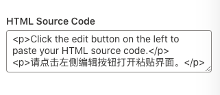
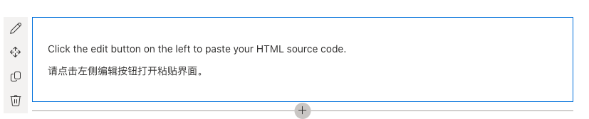

# SPFX HTML Reader Beta

This web part allows users to inject HTML DOM into SharePoint pages.

## Precaution

- Codes containing script tags will not pass the validation of potential [XSS](https://en.wikipedia.org/wiki/Cross-site_scripting) attacks, and the web part will stop working until scripts get removed.
- Codes will be futher cleaned by [sanition](https://github.com/cure53/DOMPurify) tools.
- ./config/serve.json file that contins information of server entry point will not be uploaded to this repository.
